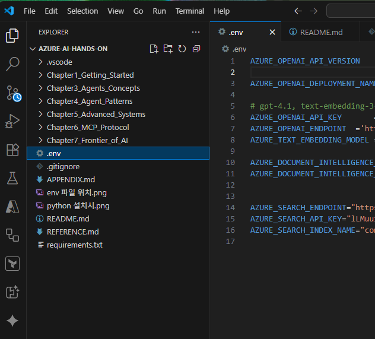

# Microsoft Foundry Agent Hands-on: 6시간 집중 실습

이 리포지토리는 기존 Azure OpenAI 중심 예제를 Microsoft Foundry 기반 에이전트 실습으로 재구성한 6시간 Hands-on 강의 자료입니다. 모든 신규 공통 실행 경로는 OpenAI-compatible endpoint, API key, 모델 배포명, OpenTelemetry tracing을 기준으로 동작합니다.

교육 목표는 생성형 AI 호출에서 출발해 prompt-style agent, RAG, MCP 도구 서버, trace와 guardrails, 실제 Foundry Agent Service agent 생성까지 이어지는 운영형 에이전트 개발 흐름을 경험하는 것입니다.

[Hands-on-Lab PDF 파일 다운로드](HOL.pdf)

## 전체 목차

- **Part 1: AI 개발의 기초 다지기**
  - [제1장: 생성형 AI 첫걸음: Python으로 시작하기](./Chapter1_Getting_Started/README.md)
  - [제2장: Microsoft Foundry 프로젝트와 공통 실행 기반](./Chapter2_Foundry_Fundamentals/README.md)
- **Part 2: 지능형 AI 에이전트 구축**
  - [제3장: AI 에이전트의 세계: 기본 개념과 프레임워크](./Chapter3_Agents_Concepts/README.md)
  - [제4장: 핵심 AI 에이전트 디자인 패턴](./Chapter4_Agent_Patterns/README.md)
  - [제5장: 고급 에이전트 시스템: 다중 에이전트 협업](./Chapter5_Advanced_Systems/README.md)
- **Part 3: 전문 AI 시스템 아키텍처링**
  - [제6장: 확장 가능한 AI 시스템 설계: 모델 컨텍스트 프로토콜(MCP)](./Chapter6_MCP_Protocol/README.md)
  - [제7장: AI 에이전트의 최전선: 프로덕션, 자율성, 그리고 윤리](./Chapter7_Frontier_of_AI/README.md)
  - [제8장: Microsoft Foundry Agent Service와 RAG 도구 연결](./Chapter8_Foundry_Agents/README.md)
- [부록: AI 프로젝트의 보이지 않는 설계도: 환경과 구성 파일 심층 분석](./APPENDIX.md)
- [트러블슈팅 가이드: 회사 보안 환경(인증서, 안티바이러스)과 Windows 설정](./TROUBLESHOOTING.md)

## 시작하기 전에

이 커리큘럼을 시작하려면 먼저 아래 **필요한 서비스/구독과 OS별 소프트웨어**를 준비합니다. endpoint, API key, 모델 배포, Application Insights 같은 실제 리소스 생성과 `.env` 설정은 준비물이 갖춰진 다음 [실습 환경 처음 잡기](#실습-환경-처음-잡기)에서 진행합니다.

> [!NOTE]
> 이 문서의 명령 예시는 OS에 따라 문법이 다른 경우 **Windows (PowerShell)** 와 **macOS / Linux (bash, zsh)** 블록으로 나눠 표기합니다. 본인이 사용하는 OS의 블록을 따라 실행하세요. `uv run ...`처럼 양쪽이 동일한 명령은 그대로 사용하면 됩니다.

### 1. 필요한 서비스와 구독

실습은 Microsoft Foundry 또는 Azure OpenAI의 OpenAI-compatible endpoint를 기준으로 진행합니다. 모델 배포, tracing, MCP 스타일 도구 서버, Foundry Agent Service를 API key 기반 호출 흐름에서 단계적으로 실습합니다. 따라서 다음 서비스에 접근할 수 있는 계정이 필요합니다.

- Microsoft Azure 구독(계정)
- Microsoft Foundry 프로젝트 또는 Azure OpenAI 리소스를 만들 수 있는 권한
- (8장에서만 필요) Azure AI Search, Knowledge Base, Application Insights, Log Analytics 사용 권한

> [!NOTE]
> **1장부터 7장까지는 미리 만들어진 Foundry 프로젝트(모델 배포 포함)만으로 따라갈 수 있습니다.** 별도의 Azure 리소스 배포는 **8장에서만** 필요합니다 — Azure AI Search, Knowledge Base, Application Insights, Log Analytics.

이 단계에서는 "이런 서비스를 쓸 수 있는 계정과 권한이 있는지"만 확인합니다. 실제 endpoint/API key 확보, 모델 배포, tracing, Application Insights 생성 같은 리소스 준비는 아래 소프트웨어 설치를 마친 뒤 [실습 환경 처음 잡기](#실습-환경-처음-잡기)에서 단계별로 진행합니다.

> [!IMPORTANT]
> **개인 신용카드로 트라이얼/구독을 만들어 참여하는 경우, 비용 관리에 주의하세요.**
>
> - **DCC(원화 결제) 차단:** 카드 등록, 결제 시 해외 통화(예: USD)로 청구될 때 카드사나 결제 화면이 "원화로 결제(DCC)"를 제안하면 **거절하고 청구 통화 그대로 결제**합니다. DCC는 환율에 수수료가 얹혀 더 비쌉니다.
> - **단일 리소스 그룹:** 8장에서 직접 만드는 리소스(Azure AI Search, Knowledge Base, Application Insights, Log Analytics)는 모두 **하나의 전용 리소스 그룹**에 만드세요.
> - **실습 종료 후 삭제:** 실습이 끝나면 그 리소스 그룹을 통째로 삭제하면 과금이 한 번에 정리됩니다. (포털에서 리소스 그룹 삭제, 또는 `az group delete --name <resource-group> --yes`)

### 2. uv 설치와 Python 3.11.9 (Python은 uv가 자동 관리)

이 실습은 **[uv](https://docs.astral.sh/uv/) 기반 실행을 기본으로 안내합니다.** uv는 패키지 관리자이자 Python 버전 관리자로, 가상 환경 생성, 활성화, 패키지 설치를 한 번에 처리하고 실습용 Python 인터프리터까지 자동으로 내려받습니다. 초심자가 가장 자주 막히는 "Python 설치 / PATH 설정 / venv 활성화" 단계를 건너뛸 수 있습니다.

uv는 OS와 선호하는 패키지 매니저에 따라 여러 방법으로 설치할 수 있습니다. 가장 간단한 방법은 **공식 설치 스크립트**이며, 이미 패키지 매니저를 쓰고 있다면 그쪽이 더 편할 수 있습니다.

#### 방법 A. 공식 설치 스크립트 (권장)

Windows (PowerShell):

```powershell
powershell -ExecutionPolicy ByPass -c "irm https://astral.sh/uv/install.ps1 | iex"
```

macOS / Linux (bash, zsh):

```bash
curl -LsSf https://astral.sh/uv/install.sh | sh
```

> `curl`이 없는 환경에서는 `wget -qO- https://astral.sh/uv/install.sh | sh`를 사용합니다.

#### 방법 B. 패키지 매니저

Windows:

```powershell
winget install --id=astral-sh.uv -e   # WinGet
scoop install main/uv                 # Scoop (커뮤니티 패키지)
choco install uv                      # Chocolatey (커뮤니티 패키지)
```

macOS / Linux (Homebrew):

```bash
brew install uv
```

모든 OS 공통 (Python 도구 / Rust):

```bash
pipx install uv            # pipx (권장)
pip install uv             # pip
cargo install --locked uv  # Rust cargo
```

설치 후 새 터미널에서 버전을 확인합니다.

```bash
uv --version
```

이 저장소에는 `.python-version`(3.11.9)이 포함되어 있어, `uv sync` 또는 `uv run`을 처음 실행할 때 **uv가 Python 3.11.9를 자동으로 내려받아 고정**합니다. 따라서 Python을 별도로 설치할 필요가 없습니다. 이후 uv를 최신 버전으로 올릴 때는 `uv self update`(스크립트로 설치한 경우) 또는 설치에 사용한 패키지 매니저의 업그레이드 명령을 사용합니다.

> 수동 설치를 선호한다면 Python 3.11.9를 직접 설치할 수도 있습니다. 설치 후 `python --version`(또는 `python3 --version`)이 `Python 3.11.9`를 출력하는지 확인하세요. 최신 버전에서도 일부 예제가 동작하지만, 패키지 호환성을 위해 3.11.9를 권장합니다.
>
> - **Windows:** [Python 3.11.9 for Windows](https://www.python.org/downloads/windows/)를 받아 설치하고, 설치 화면에서 `Add python.exe to PATH`를 체크합니다.
> - **macOS:** [python.org macOS 설치본](https://www.python.org/downloads/macos/)을 받거나 `brew install python@3.11`(Homebrew) 또는 `pyenv install 3.11.9`(pyenv)를 사용합니다.
> - **Linux:** 배포판 패키지 매니저(`apt`, `dnf` 등) 또는 `pyenv install 3.11.9`로 설치합니다.

### 3. VS Code 설치

실습 코드는 VS Code에서 실행하는 것을 기준으로 구성되어 있습니다.

- 다운로드: [Visual Studio Code](https://code.visualstudio.com/)
- 권장 확장: Python, Pylance, Azure Account
- VS Code의 통합 터미널을 사용하면 편리합니다(Windows: PowerShell, macOS/Linux: zsh 또는 bash).

VS Code Python 확장은 다음 [실습 환경 처음 잡기](#실습-환경-처음-잡기) 단계에서 만들 `.venv`를 자동으로 인식해 코드 자동완성(IntelliSense), ▶ 실행 버튼, F5 디버깅을 지원합니다.

## 실습 환경 처음 잡기

준비물(서비스/구독, uv, VS Code)이 갖춰졌으면 이제 실제 실습 환경을 잡습니다. 아래 순서대로 진행하면 저장소 내려받기 → 의존성 설치 → Foundry 리소스 연결 → 기본 설정 확인까지 한 번에 끝납니다.

> [!TIP]
> 회사 노트북처럼 **TLS 검사 프록시(Zscaler 등), 기업 안티바이러스, 관리형 Windows 정책**이 걸린 환경에서 `uv sync` / `uv run` / `az login`이 인증서 오류나 설치 실패로 막히면 [트러블슈팅 가이드](./TROUBLESHOOTING.md)를 참고하세요.

### 1. 저장소 가져오기

각 실습자 PC에 이 저장소를 먼저 내려받습니다. 공개 저장소이므로 웹 브라우저에서 ZIP으로 받으면 됩니다. 파일만 받기 때문에 git 이력이나 원본 저장소와의 연결이 없는 독립 복사본이 되고, git을 설치하지 않아도 됩니다.

1. 웹 브라우저에서 저장소 페이지(<https://github.com/mzc-azure-presales/azure-foundry-agent-hands-on>)를 엽니다.
2. 초록색 **Code** 버튼을 누르고 **Download ZIP**을 선택합니다.
3. 내려받은 ZIP을 원하는 폴더에 압축 해제합니다.

이후 저장소에 변경 사항이 생기면 같은 방식으로 ZIP을 다시 내려받아 사용합니다.

### 2. 저장소 열고 의존성 설치

위에서 받은 폴더를 VS Code에서 연 뒤, 통합 터미널에서 아래 한 줄로 실습 환경을 만듭니다.

```bash
uv sync
```

이 명령은 `pyproject.toml`과 `uv.lock`을 읽어 저장소 루트에 `.venv`를 생성하고, 고정된 버전의 모든 패키지를 한 번에 설치합니다(Python 3.11.9가 없으면 자동으로 내려받습니다). OpenTelemetry 3종(`opentelemetry-api==1.38.0`, `opentelemetry-sdk==1.38.0`, `opentelemetry-semantic-conventions==0.59b0`)을 비롯한 모든 버전은 `uv.lock`에 고정되어 있어, 누가 실행해도 동일한 조합이 설치됩니다(Application Insights trace exporter 호환). `pip` 방식에서 자주 보던 "이미 설치된 `opentelemetry` 패키지가 더 높은 버전으로 남아 `cannot import name 'LogData'` 오류" 문제가 발생하지 않습니다.

설치 후 환경이 lockfile과 일치하는지 확인합니다.

```bash
uv sync --frozen --check
```

> 이 저장소는 의존성 관리를 `pyproject.toml` + `uv.lock`으로 일원화합니다. `pip` 기반 워크플로가 필요하면 `uv export --format requirements-txt > requirements.txt`로 언제든 생성할 수 있습니다.

생성된 `.venv`는 VS Code Python 확장이 자동으로 감지합니다. 우측 하단 또는 명령 팔레트(`Python: Select Interpreter`)에서 `.venv`가 선택되면, 코드 자동완성(IntelliSense), ▶ 실행 버튼, F5 디버깅이 모두 정상 동작합니다. 인터프리터가 자동으로 잡히지 않으면 직접 선택하세요. Windows는 `.\.venv\Scripts\python.exe`, macOS/Linux는 `./.venv/bin/python`입니다.

### 3. Foundry 프로젝트와 엔드포인트, API key 준비

트라이얼 계정으로 직접 Foundry 프로젝트를 만드는 경우, 먼저 **전용 리소스 그룹**을 만들고 그 안에 Foundry 프로젝트(리소스)를 생성합니다. 이때 **리전 선택이 모델, 기능 가용성을 좌우**합니다.

> [!TIP]
> Microsoft Learn은 **East US 2**와 **Sweden Central**을 *권장 (recommended)* 리전으로 안내합니다. 신규 모델, 기능과 프리뷰가 가장 먼저 들어와 가용성이 가장 넓고, 8장 Agent Service가 요구하는 Azure OpenAI Responses API도 지원합니다. Korea Central 등 다른 리전은 프로덕션에 정식 지원되지만 신규 모델이 늦게 들어올 수 있습니다. **특별한 목적이나 의도가 없다면 리소스 그룹과 Foundry 프로젝트를 East US 2(또는 Sweden Central)에 만드는 것을 권장합니다.** (최신 기능을 모두 사용해볼 수 있기에 추천합니다.) 최신 가용성은 [Microsoft Foundry 리전 지원](https://learn.microsoft.com/azure/foundry/reference/region-support) 문서에서 확인하세요.

실습의 공통 실행 경로는 OpenAI-compatible endpoint와 API key를 사용합니다.

준비 항목은 다음과 같습니다.

- OpenAI-compatible endpoint 1개
- API key 1개
- Endpoint 값: `.env`의 `FOUNDRY_OPENAI_ENDPOINT`에 입력합니다.
- API key 값: `.env`의 `FOUNDRY_API_KEY`에 입력합니다.

Azure OpenAI endpoint는 보통 다음 형태입니다.

```bash
https://<resource>.openai.azure.com/
```

Foundry inference endpoint를 직접 쓰는 경우에는 `FOUNDRY_OPENAI_ENDPOINT_TYPE=foundry`로 바꾸고, endpoint를 OpenAI-compatible base URL로 입력합니다. `.env`는 `.env.example`을 복사해 만들며, 전체 변수 예시는 아래 [.env 샘플 코드](#env-샘플-코드)에 있습니다.

### 4. 모델 배포

이 실습의 기본 예제는 다음 모델 배포 이름을 사용합니다.

- Chat/Responses 모델 배포: `gpt-5.2`
- Embeddings 모델 배포: `text-embedding-3-small`

모델 배포 이름은 Azure 모델 이름이 아니라 Foundry 프로젝트 안에서 만든 배포 이름입니다. 다른 이름으로 배포했다면 `.env`에서 아래 값을 실제 배포 이름에 맞게 변경하세요.

```bash
FOUNDRY_MODEL_DEPLOYMENT_NAME=gpt-5.2
FOUNDRY_EMBEDDING_DEPLOYMENT_NAME=text-embedding-3-small
```

모델 배포가 준비되지 않으면 1장의 첫 모델 호출, 2장의 Responses API smoke test, 4장의 RAG 예제가 정상 동작하지 않습니다.

### 5. (선택) Foundry Tracing 연결

Tracing 연결은 필수는 아니지만 강력히 권장합니다. 연결되어 있으면 Foundry 포털에서 요청, 응답, latency, error span을 추적할 수 있습니다. 도구 호출이나 실제 Agent Service 실행 trace는 해당 선택 실습을 실행하는 환경에서 확인합니다.

- Tracing 연결이 있는 경우: Foundry/monitoring 화면에서 trace를 확인하며 실습합니다.
- Tracing 연결이 없는 경우: 코드가 콘솔 trace로 대체 실행되므로 핵심 실습은 계속 진행할 수 있습니다.

Tracing 관련 예제는 다음 파일에서 확인합니다.

```bash
uv run Chapter2_Foundry_Fundamentals/2.3_foundry_tracing_smoke_test.py
uv run Chapter8_Foundry_Agents/8.4_foundry_agent_monitoring.py
```

### 6. (선택) Application Insights 생성

Application Insights connection string은 Application Insights 리소스를 먼저 만들어야 확인할 수 있습니다. 8장 monitoring과 Azure Monitor trace를 보려면 강의 전에 Azure Portal에서 다음 순서로 준비합니다.

1. Azure Portal에서 **Application Insights**를 검색해 새 리소스를 만듭니다.
2. 실습 Foundry resource와 같은 subscription/resource group/region을 선택합니다.
3. **Workspace-based** Application Insights를 선택하고 Log Analytics workspace를 새로 만들거나 기존 workspace를 연결합니다.
4. 생성이 끝나면 Application Insights 리소스의 **Overview** 또는 **Properties**에서 **Connection String** 값을 복사합니다.
5. `.env`에 다음처럼 붙여 넣습니다.

    ```bash
    FOUNDRY_APPLICATIONINSIGHTS_CONNECTION_STRING=<application-insights-connection-string>
    FOUNDRY_APPLICATIONINSIGHTS_AUTO_CREATE=false
    ```

이 값은 로컬 Python 코드의 OpenTelemetry span을 Azure Monitor로 보내는 데 사용합니다. Foundry 포털의 agent 추적/monitoring 화면에서도 같은 telemetry를 보려면, 포털에서 project 또는 agent의 monitoring/trace 화면에 표시되는 Application Insights 연결 배너를 통해 같은 리소스를 연결합니다.

Application Insights를 만들지 않아도 실습 코드는 콘솔 trace로 계속 실행됩니다. 다만 8.4에서 Azure Portal이나 Foundry 포털의 monitoring 데이터를 함께 보려면 connection string과 포털 연결이 필요합니다.

### 7. 기본 설정 확인

이 리포지토리의 공통 실행 코드는 Azure CLI 로그인을 사용하지 않습니다. `.env`에 endpoint와 API key를 넣은 뒤 아래 명령으로 기본 환경을 먼저 확인하세요.

먼저 도우미 스크립트로 `.env` 항목이 제대로 채워졌는지 한 번에 점검할 수 있습니다. MS Foundry 핵심 설정은 필수(없으면 실패), 8장 확장용 설정은 선택(없으면 경고)으로 구분해 보고하고, `.env.example`의 자리표시자(`<...>`)를 안 채운 경우도 잡아 줍니다.

```bash
uv run python check_env.py
```

이어서 Foundry 연결 정보까지 포함해 확인합니다.

```bash
uv run Chapter2_Foundry_Fundamentals/2.1_check_foundry_settings.py
```

> 실행 방법은 두 가지입니다. ① 터미널에서 `uv run <스크립트>` — 환경 동기화를 자동 보장합니다. ② VS Code에서 `.venv` 인터프리터를 선택한 뒤 파일을 열고 ▶ 버튼 또는 F5로 실행. 두 방식 모두 동일하게 동작합니다.

## 커리큘럼 구조

각 챕터는 별도의 폴더로 구성되어 있습니다. 각 폴더에는 해당 챕터의 모든 이론적 설명과 개념을 담은 `README.md` 파일과, 실습에 사용되는 번호가 붙은 소스 코드 파일이 포함되어 있습니다.

강의 전체 흐름은 `CURRICULUM_SCENARIO.md`에서 한 번에 확인할 수 있습니다. 챕터별 세부 실행 방법과 수동 설정 절차는 각 챕터 폴더의 `README.md`를 참고하세요.

## 실행 결과를 읽는 기준

각 Python 파일 상단에는 루트 폴더 기준 실행 명령과 학습 포인트가 주석으로 들어 있습니다. 모든 실습 파일은 `_bootstrap.py`를 먼저 import하여 저장소 루트의 `foundry_hands_on` 패키지를 찾고, 실행 시작 시 `실습 파일`, `실행 명령`, `학습 목표`, `쉽게 말하면`, `관찰 포인트`를 자동으로 출력합니다. 따라서 초보 학습자는 먼저 이 안내 블록을 읽고, 그 다음 코드가 어떤 입력과 결과를 만드는지 따라가면 됩니다.

예제 실행 중에는 모델 응답만 보지 말고, 어떤 prompt가 모델에 전달되는지, 이전 응답이 다음 단계 입력으로 다시 들어가는지, trace span이 콘솔에 어떻게 출력되는지를 함께 확인합니다. 6장의 서버/클라이언트 예제는 서버 터미널에도 클라이언트 질문과 서버 답변을 출력하므로, 클라이언트 터미널과 서버 터미널을 나란히 보며 요청/응답 흐름을 관찰합니다.

이 저장소의 기본 상태 관리는 서버 영구 메모리가 아니라 Python 코드의 변수에 저장됩니다. 예를 들어 multi-turn과 stateful 예제는 `messages` 리스트에 user/assistant 메시지를 누적한 뒤 다음 호출에 다시 보냅니다. 프로그램을 종료하면 이 메모리는 사라지며, 파일, DB, Foundry 서버에 자동 저장되지 않습니다.

Tracing은 기본적으로 콘솔 exporter로 OpenTelemetry span을 출력합니다. Application Insights 연결 문자열을 별도로 설정한 경우에만 Azure Monitor로 전송됩니다.

## 커리큘럼 요약

이 커리큘럼은 하나의 사내 정책 Q&A 에이전트를 단계적으로 고도화하는 흐름으로 구성되어 있습니다. 처음에는 OpenAI-compatible endpoint의 모델을 직접 호출하고, 이후 공통 실행 계층, prompt-style agent, RAG, multi-agent, MCP 스타일 도구 서버, 운영 통제, 실제 Foundry Agent Service agent 생성까지 확장합니다.

전체 학습 흐름은 다음과 같습니다.

1. Foundry 프로젝트와 로컬 Python 실행 환경을 준비합니다.
2. Responses API로 기본 모델 호출과 프롬프트 패턴을 익힙니다.
3. OpenAI-compatible endpoint, API key, tracing을 공통 코드로 정리합니다.
4. 단순 모델 호출을 역할 지시문 기반 prompt-style agent로 전환합니다.
5. 도구 호출과 RAG를 붙여 모델이 모르는 지식과 계산을 보완합니다.
6. 여러 역할의 에이전트와 Streamlit UI를 연결해 사용자-facing 앱 형태로 확장합니다.
7. MCP 스타일 서버로 에이전트 기능을 외부 도구/API처럼 분리합니다.
8. 운영 단계에서 필요한 guardrails, human review, reflection 패턴을 확인합니다.
9. Foundry Project SDK로 실제 agent version을 생성하고 RAG/Search tool 연결 및 포털 모니터링 방식을 확인합니다.

| 챕터 | 주제 | 핵심 학습 내용 | 대표 실습 |
| --- | --- | --- | --- |
| 준비 | Foundry 프로젝트와 로컬 환경 | `.env`, API key, uv 환경(`uv sync`), 패키지 설치 | `pyproject.toml`, `uv.lock`, `.env` |
| 1장 | 생성형 AI 첫걸음 | Responses API 호출, 역할 부여, few-shot, multi-turn 프롬프트 | `1.5_first_openai_call.py`, `1.6.4.4_mulit_turn.py` |
| 2장 | Foundry 공통 실행 기반 | 설정 검증, 공통 client, OpenTelemetry tracing smoke test | `2.1_check_foundry_settings.py`, `2.2_foundry_responses_smoke_test.py`, `2.3_foundry_tracing_smoke_test.py` |
| 3장 | Prompt-style Agent | 역할 지시문, 도구 필요성, 상태 유지 패턴 | `3.4.2_agent_app.py`, `3.4.4_agent_with_calculator.py`, `3.4.5_stateful_agent.py` |
| 4장 | Tool Use와 RAG | 계산 도구, 문서 기반 검색, embedding 기반 관련 문맥 선택, AI planner 기반 multi-tool routing | `4.2.1_multi_tool_agent.py`, `4.3.2_rag_agent.py`, `4.4.4.6_multi_tool_agent.py` |
| 5장 | Multi-agent와 UI | 역할 분리형 에이전트, Streamlit 웹 UI, 대화형 앱 구성 | `5.2.1_multi_agent_system.py`, `5.3.1_streamlit_app.py` |
| 6장 | MCP/확장 도구 | RAG 기능을 HTTP 도구 서버로 분리, 선택 세션 서버 | `6.6.1_mcp_server_ai_search.py`, `6.4.2_mcp_flask_server.py` |
| 7장 | 운영 통제 | guardrails, human review, reflection loop | `7.3.1_langgraph_interrupt.py`, `7.4.1_reflection_loop.py`, `7.6.1_guardrails.py` |
| 8장 | Foundry Agent Service | Foundry Project SDK 기반 agent 생성/등록/실행, RAG chunk/vector, Azure AI Search tool, Knowledge base retrieve, MCPTool 코드 연결, 포털 모니터링 | `8.1_create_and_run_foundry_agent.py`, `8.2_create_foundry_agent_with_knowledge_base.py`, `8.3_create_foundry_agent_with_mcp.py`, `8.4_foundry_agent_monitoring.py` |

최종적으로 학습자는 API key 기반 모델 호출에서 시작해, prompt-style agent, RAG, MCP 스타일 도구 서버, Streamlit UI, OpenTelemetry trace, guardrails, Foundry Project SDK 기반 agent를 하나의 운영형 에이전트 시스템 관점에서 이해하고 실행할 수 있어야 합니다.

## .env 샘플 코드

`.env.example`을 복사해 `.env`를 만든 뒤 값을 채우세요.

```bash
cp ./.env.example ./.env
```

```bash
# 공통 모델 호출 (1장~7장, 필수)
FOUNDRY_OPENAI_ENDPOINT=https://<resource>.openai.azure.com/
FOUNDRY_API_KEY=<your-api-key>
FOUNDRY_OPENAI_API_VERSION=2025-04-01-preview
FOUNDRY_OPENAI_ENDPOINT_TYPE=azure_openai
FOUNDRY_MODEL_DEPLOYMENT_NAME=gpt-5.2
FOUNDRY_EMBEDDING_DEPLOYMENT_NAME=text-embedding-3-small
FOUNDRY_REASONING_EFFORT=low

# 7장 선택 토글 (사람 대신 모델이 편집 단계를 수행)
# CHAPTER7_USE_MODEL_EDITOR=false

# Tracing / Application Insights (2.3, 8장 trace, monitoring)
# 연결 문자열이 없으면 콘솔 exporter로 자동 동작합니다.
FOUNDRY_APPLICATIONINSIGHTS_CONNECTION_STRING=<application-insights-connection-string>
# trace에 prompt/응답 본문까지 기록하려면 true (기본 false)
# AZURE_TRACING_GEN_AI_CONTENT_RECORDING_ENABLED=false

# 8장 Foundry Agent Service 프로젝트 연결 (8.1~8.4)
FOUNDRY_PROJECT_ENDPOINT=https://<resource>.services.ai.azure.com/api/projects/<project>
FOUNDRY_PROJECT_RESOURCE_ID=/subscriptions/<subscription-id>/resourceGroups/<resource-group>/providers/Microsoft.CognitiveServices/accounts/<account-name>/projects/<project-name>
FOUNDRY_KEEP_AGENT=false
# 기존 conversation을 이어서 실행할 때만 지정 (8.1/8.2/8.3 공통 fallback)
# FOUNDRY_AGENT_CONVERSATION_ID=

# 8.1 Azure AI Search + Foundry Search connection
AZURE_SEARCH_ENDPOINT=https://<search-service>.search.windows.net
AZURE_SEARCH_SERVICE_NAME=<search-service>
AZURE_SEARCH_API_KEY=<search-key>
AZURE_SEARCH_INDEX_NAME=foundry-agent-rag-index
FOUNDRY_AI_SEARCH_CONNECTION_NAME=<foundry-search-connection-name>
FOUNDRY_AI_SEARCH_QUERY_TYPE=simple
# connection 이름 대신 전체 리소스 ID로 직접 지정할 때만 사용
# FOUNDRY_AI_SEARCH_CONNECTION_ID=

# 8.1/8.4 Application Insights 자동 생성, 모니터링 (선택)
# AUTO_CREATE=true 이고 AZURE_RESOURCE_GROUP이 있을 때만 자동 생성합니다.
# 8.4 monitoring은 FOUNDRY_APPLICATIONINSIGHTS_NAME으로 리소스를 찾습니다.
FOUNDRY_APPLICATIONINSIGHTS_AUTO_CREATE=false
FOUNDRY_APPLICATIONINSIGHTS_NAME=appi-foundry-hands-on
FOUNDRY_LOG_ANALYTICS_WORKSPACE_NAME=log-foundry-hands-on
# AZURE_RESOURCE_GROUP=<resource-group>
# AZURE_LOCATION=eastus2

# 8.2 Knowledge base agent
FOUNDRY_KNOWLEDGE_BASE_NAME=<knowledge-base-name>
FOUNDRY_KB_MCP_CONNECTION_NAME=chapter-8-2-kb-mcp-connection
FOUNDRY_KB_AGENT_NAME=chapter-8-2-knowledge-base-agent
FOUNDRY_KB_TEST_QUESTION=회사 정책에서 재택근무와 보안 관련 핵심 규칙을 요약해 주세요.
# FOUNDRY_KB_AGENT_CONVERSATION_ID=

# 8.3 Microsoft Learn MCPTool
FOUNDRY_DEMO_MCP_CONNECTION_NAME=microsoft-learn-mcp
FOUNDRY_DEMO_MCP_SERVER_URL=https://learn.microsoft.com/api/mcp
FOUNDRY_DEMO_MCP_AGENT_NAME=chapter-8-3-learn-mcp-agent
FOUNDRY_DEMO_MCP_ALLOWED_TOOLS=microsoft_docs_search,microsoft_docs_fetch,microsoft_code_sample_search
FOUNDRY_DEMO_MCP_TEST_QUESTION=How can I create a Microsoft Foundry project using Azure CLI?
# FOUNDRY_DEMO_MCP_AGENT_CONVERSATION_ID=
```

참고로 `.env` 파일은 다음과 같이 이 리포지터리 디렉터리의 루트에 `.env.example` 파일을 복사하여 `.env` 파일로 만듭니다.



`.env.example`은 실제 `.env`와 같은 변수 이름만 갖도록 관리합니다. 새 환경 변수를 추가할 때는 두 파일의 변수 목록이 같은지 확인하세요.

8장 선택 실습은 실행 전에 수동 준비가 필요합니다. 특히 8.1은 Azure AI Search service와 Foundry Search connection이 필요하고, 8.2는 Foundry 포털 또는 Azure Portal에서 Knowledge base를 먼저 만든 뒤 코드가 그 MCP endpoint를 가리키는 RemoteTool/MCP project connection을 생성합니다. 8.4 monitoring을 보려면 Application Insights를 수동 생성하고 connection string을 `.env`에 넣은 뒤, Foundry 포털에서도 같은 Application Insights 리소스를 연결합니다. 자세한 체크리스트와 생성 순서는 [Chapter8_Foundry_Agents/README.md](Chapter8_Foundry_Agents/README.md)를 확인하세요.

## 초기 설정 변수와 준비 작업 매핑

강의 전에 설치하거나 포털에서 준비한 값은 아래 `.env` 변수와 매칭됩니다. secret 값은 README나 화면 공유에 노출하지 말고, 로컬 `.env`에만 입력합니다.

| 준비/설치 작업 | 확인 위치 | `.env` 변수 | 사용하는 범위 |
| --- | --- | --- | --- |
| OpenAI-compatible endpoint 확인 | Foundry 또는 Azure OpenAI 리소스의 endpoint/API key 화면 | `FOUNDRY_OPENAI_ENDPOINT`, `FOUNDRY_API_KEY`, `FOUNDRY_OPENAI_API_VERSION`, `FOUNDRY_OPENAI_ENDPOINT_TYPE` | 1장-7장 기본 모델 호출 |
| 모델 배포 생성 | Foundry project의 model deployments | `FOUNDRY_MODEL_DEPLOYMENT_NAME`, `FOUNDRY_EMBEDDING_DEPLOYMENT_NAME` | 전체 모델 호출, 4장/8장 RAG |
| reasoning 기본값 고정 | `.env.example` 기본값 유지 | `FOUNDRY_REASONING_EFFORT` | 1장-7장 Responses API 호출 |
| Python 라이브러리 설치 | `uv sync` (pyproject.toml + uv.lock) | 직접 `.env` 변수는 없지만 OpenTelemetry/Application Insights 호환 버전을 고정 설치 | 전체 실습 실행 전 필수 |
| Foundry Agent Service project 확인 | Foundry project overview와 Azure Portal resource JSON | `FOUNDRY_PROJECT_ENDPOINT`, `FOUNDRY_PROJECT_RESOURCE_ID`, `FOUNDRY_KEEP_AGENT` | 8.1, 8.2, 8.3, 8.4 |
| Azure 로그인 | `az login` 또는 VS Code Azure Account | 직접 `.env` 변수는 없지만 `DefaultAzureCredential`이 사용 | 8.1, 8.2, 8.3 |
| Azure AI Search 생성 | Azure AI Search Overview와 Keys 화면 | `AZURE_SEARCH_ENDPOINT`, `AZURE_SEARCH_SERVICE_NAME`, `AZURE_SEARCH_API_KEY`, `AZURE_SEARCH_INDEX_NAME` | 8.1 index 생성, 8.2 Knowledge base MCP endpoint |
| Foundry Search connection 생성 | Foundry project Connections | `FOUNDRY_AI_SEARCH_CONNECTION_NAME`, `FOUNDRY_AI_SEARCH_QUERY_TYPE`, `FOUNDRY_AI_SEARCH_CONNECTION_ID`(선택) | 8.1 Search tool 연결 |
| Application Insights 생성 | Azure Portal Application Insights 리소스 | `FOUNDRY_APPLICATIONINSIGHTS_CONNECTION_STRING`, `FOUNDRY_APPLICATIONINSIGHTS_NAME` | 2.3 trace, 8장 monitoring/trace |
| Application Insights 자동 생성(선택) | `FOUNDRY_APPLICATIONINSIGHTS_AUTO_CREATE=true`로 켰을 때만 사용 | `FOUNDRY_APPLICATIONINSIGHTS_AUTO_CREATE`, `AZURE_RESOURCE_GROUP`, `AZURE_LOCATION`, `FOUNDRY_LOG_ANALYTICS_WORKSPACE_NAME` | 8.1 App Insights/Log Analytics 자동 준비 |
| Knowledge base 생성 | Foundry IQ 또는 Azure AI Search Knowledge bases | `FOUNDRY_KNOWLEDGE_BASE_NAME`, `FOUNDRY_KB_MCP_CONNECTION_NAME`, `FOUNDRY_KB_AGENT_NAME`, `FOUNDRY_KB_TEST_QUESTION` | 8.2 Knowledge base MCPTool |
| Microsoft Learn MCP 설정 | 기본 공개 endpoint 사용, 필요 시 질문/도구 목록 변경 | `FOUNDRY_DEMO_MCP_CONNECTION_NAME`, `FOUNDRY_DEMO_MCP_SERVER_URL`, `FOUNDRY_DEMO_MCP_AGENT_NAME`, `FOUNDRY_DEMO_MCP_ALLOWED_TOOLS`, `FOUNDRY_DEMO_MCP_TEST_QUESTION` | 8.3 MCPTool |
| (선택) 대화 이어가기, 디버그 토글 | 기본값으로 두면 매번 새 conversation 생성, 콘솔 trace 사용 | `FOUNDRY_AGENT_CONVERSATION_ID`, `FOUNDRY_KB_AGENT_CONVERSATION_ID`, `FOUNDRY_DEMO_MCP_AGENT_CONVERSATION_ID`, `CHAPTER7_USE_MODEL_EDITOR`, `AZURE_TRACING_GEN_AI_CONTENT_RECORDING_ENABLED` | 7장 토글, 8장 conversation 재사용/trace 본문 기록 |

## 강의 전 초기 설정 체크리스트

강의 시작 전에 아래 항목을 한 번에 확인합니다.

- `uv --version`이 정상 출력됩니다(미설치 시 위 5번 안내로 설치). uv가 `.python-version`의 Python 3.11.9를 자동 사용합니다.
- VS Code에서 이 저장소 폴더를 열고 통합 터미널을 사용합니다(Windows: PowerShell, macOS/Linux: zsh, bash).
- `.env.example`을 복사해 `.env`를 만들고, API key와 endpoint는 실제 값으로 채웁니다.
- `FOUNDRY_REASONING_EFFORT=low`를 유지합니다. Agent Service 예제는 reasoning 옵션을 보내지 않습니다.
- `uv sync`를 완료해 `.venv`가 생성되고, VS Code Python 확장이 `.venv`를 인터프리터로 감지합니다.
- `uv run Chapter2_Foundry_Fundamentals/2.1_check_foundry_settings.py`로 기본 설정을 확인합니다.
- 8장을 실행할 경우 `az login` 또는 VS Code Azure Account 로그인을 완료하고 `FOUNDRY_PROJECT_ENDPOINT`, `FOUNDRY_PROJECT_RESOURCE_ID`를 설정합니다.
- 8.1/8.2를 실행할 경우 Azure AI Search endpoint/key와 Foundry Knowledge base 준비 상태를 확인합니다.
- 8.4 monitoring을 볼 경우 Application Insights 리소스를 먼저 만들고 connection string을 `.env`에 넣은 뒤, Foundry 포털에서도 같은 Application Insights 리소스를 연결했는지 확인합니다.

## 6시간 Hands-on 진행표

순수 실습 시간은 약 6시간이며, 15분 휴식과 1시간 점심 시간을 포함해 오전 9시부터 오후 4시 5분까지 운영합니다.

| 시간 | 구분 | 모듈 | 실습 산출물 |
| --- | --- | --- | --- |
| 09:00-09:20 | Hands-on | Foundry 프로젝트/권한/환경 구성 | `.env`, API key 설정, 패키지 설치 확인 |
| 09:20-10:00 | Hands-on | Prompt와 Responses API | 첫 모델 호출, 역할 부여, multi-turn 예제 실행 |
| 10:00-10:15 | 휴식 | - | 1시간 학습 후 15분 휴식 |
| 10:15-10:45 | Hands-on | Foundry 공통 실행 기반 | 설정 확인, 공통 client, tracing smoke test |
| 10:45-11:15 | Hands-on | Prompt-style Agent | 기본 에이전트, 도구 필요성, 상태 유지 패턴 |
| 11:15-11:30 | 휴식 | - | 1시간 학습 후 15분 휴식 |
| 11:30-12:20 | Hands-on | Tool Use와 RAG | 회사 정책 문서 기반 답변 에이전트, multi-tool routing |
| 12:20-13:20 | 점심 | - | 점심 시간 1시간 |
| 13:20-13:50 | Hands-on | Multi-agent와 UI | 역할 분리 에이전트, Streamlit UI |
| 13:50-14:20 | Hands-on | MCP/확장 도구 | RAG 기능을 HTTP 도구 서버로 분리 |
| 14:20-14:35 | 휴식 | - | 1시간 학습 후 15분 휴식 |
| 14:35-15:05 | Hands-on | 운영 통제 | Guardrails, 근거 기반 답변 점검, reflection loop |
| 15:05-15:55 | Hands-on | Foundry Agent Service | agent version 생성/실행, Search tool, Knowledge base, MCPTool, monitoring |
| 15:55-16:05 | 정리 | 전체 | 실행 결과, trace, 포털 monitoring 결과 점검과 질의응답 |

오전 9시부터 1장부터 8장까지 번호 순서대로 진행합니다. 매 1시간 학습 후 15분 휴식을 두고, 12:20부터 13:20까지는 점심 시간으로 운영합니다. 8장은 실제 Foundry Agent Service agent를 생성/실행하고 Knowledge base retrieve, MCPTool 코드 연결, 포털 모니터링까지 확인하는 마무리 실습입니다.

## 권장 실행 순서

```bash
# Chapter0 Microsoft Foundry 란? 강의 후 아래 실습을 실행합니다.
uv run Chapter1_Getting_Started/1.5_first_openai_call.py
uv run Chapter1_Getting_Started/1.6.4.4_mulit_turn.py
uv run Chapter2_Foundry_Fundamentals/2.1_check_foundry_settings.py
uv run Chapter2_Foundry_Fundamentals/2.2_foundry_responses_smoke_test.py
uv run Chapter2_Foundry_Fundamentals/2.3_foundry_tracing_smoke_test.py
uv run Chapter3_Agents_Concepts/3.4.2_agent_app.py
uv run Chapter3_Agents_Concepts/3.4.5_stateful_agent.py
uv run Chapter4_Agent_Patterns/4.3.2_rag_agent.py
uv run Chapter4_Agent_Patterns/4.4.4.6_multi_tool_agent.py
uv run Chapter5_Advanced_Systems/5.2.1_multi_agent_system.py
uv run streamlit run Chapter5_Advanced_Systems/5.3.1_streamlit_app.py
# 6장 대표 실습: RAG 도구 서버는 터미널을 나눠 실행
# 터미널 1
uv run Chapter6_MCP_Protocol/6.6.1_mcp_server_ai_search.py
# 터미널 2
uv run Chapter6_MCP_Protocol/6.6.2_mcp_client_ai_search.py
# MCP 서버 확인 후 터미널 1에서 Ctrl+C로 종료
uv run Chapter7_Frontier_of_AI/7.6.1_guardrails.py
# 선택: Foundry 프로젝트에 실제 agent version을 생성/실행/정리
# FOUNDRY_PROJECT_ENDPOINT와 Azure 로그인/권한이 필요합니다.
# uv run Chapter8_Foundry_Agents/8.1_create_and_run_foundry_agent.py
# 선택: Knowledge base MCPTool을 Foundry agent에 연결
# uv run Chapter8_Foundry_Agents/8.2_create_foundry_agent_with_knowledge_base.py
# 선택: Microsoft Learn MCP 서버를 Foundry agent tool로 코드 연결
# uv run Chapter8_Foundry_Agents/8.3_create_foundry_agent_with_mcp.py
# 선택: Foundry 포털의 agent 모니터링 탭 확인
# uv run Chapter8_Foundry_Agents/8.4_foundry_agent_monitoring.py
```

시간이 부족하면 1장의 고급 프롬프트 예제, 4장의 고급 RAG 확장 파일, 5장의 Streamlit memory 확장, 6장의 6.4 세션 서버, 8장의 실제 agent 생성은 선택 실습으로 돌립니다. 핵심 흐름은 첫 호출, 공통 설정, prompt-style agent, RAG, MCP 스타일 RAG 도구 서버, Guardrails, Foundry Agent Service 구조입니다.

6.4 세션 서버는 선택 실습입니다. 서버와 클라이언트를 터미널 2개에서 나눠 실행합니다.

```bash
uv run Chapter6_MCP_Protocol/6.4.2_mcp_flask_server.py
uv run Chapter6_MCP_Protocol/6.4.3_mcp_client.py
```

## Foundry 공통 코드

`foundry_hands_on/` 폴더는 각 챕터에서 반복되는 설정 로딩, 모델 호출, trace 설정, RAG 검색 같은 코드를 모아 둔 공통 실행 모듈입니다. 챕터별 예제 파일은 실습 주제에 집중하고, endpoint/API key 처리와 Responses API 호출 같은 기반 코드는 이 패키지를 통해 재사용합니다.

- `foundry_hands_on/config.py`: `.env`에서 `FOUNDRY_OPENAI_ENDPOINT`, `FOUNDRY_API_KEY`, `FOUNDRY_MODEL_DEPLOYMENT_NAME`, `FOUNDRY_EMBEDDING_DEPLOYMENT_NAME`, `FOUNDRY_REASONING_EFFORT` 같은 공통 설정을 읽습니다. 모든 챕터가 같은 환경 값을 사용하게 해주는 출발점입니다.
- `foundry_hands_on/client.py`: API key 기반 OpenAI-compatible client를 만들고 Responses API를 호출합니다. 1장의 단일 턴 호출, multi-turn 예제, 2장의 smoke test가 이 모듈의 공통 함수를 사용합니다. 기본 reasoning effort는 `low`이며, 모델이나 endpoint가 reasoning 옵션을 지원하지 않으면 안내를 출력하고 reasoning 없이 재시도합니다.
- `foundry_hands_on/agents.py`: API key 기반 prompt-style agent 실행을 담당합니다. system instruction을 agent의 역할처럼 사용하고 user input을 넘겨서 연구원, 작가, 검토자 같은 역할 기반 호출을 재사용할 수 있게 합니다.
- `foundry_hands_on/rag.py`: 4장 RAG 실습에서 사용하는 교육용 로컬 RAG 유틸입니다. 문서를 chunk로 나누고, embedding을 만들고, cosine similarity로 관련 문맥을 찾은 뒤 답변 생성에 넘깁니다.
- `foundry_hands_on/tracing.py`: OpenTelemetry span을 설정합니다. Application Insights connection string이 있으면 Azure Monitor로 trace를 내보내고, 없으면 콘솔 exporter로 trace를 출력합니다.
- `foundry_hands_on/learning.py`: 각 실습 파일의 `# Run:`과 `# 학습 포인트:`를 읽어 실행 시작 시 초보자용 안내 블록을 출력합니다.

각 챕터 폴더의 `_bootstrap.py`는 두 가지 일을 합니다. 첫째, 실습 파일을 챕터 폴더에서 직접 실행해도 `foundry_hands_on` 모듈을 찾을 수 있도록 저장소 루트를 `sys.path`에 추가합니다. 둘째, `foundry_hands_on/learning.py`를 호출해 실행 시작 안내를 출력합니다.

8장의 `8.1_create_and_run_foundry_agent.py`는 예외적으로 `FOUNDRY_PROJECT_ENDPOINT`와 Azure credential을 사용해 Foundry 프로젝트 안에 실제 agent version을 생성하고 실행한 뒤 기본적으로 삭제합니다. 생성된 agent version을 포털에서 확인하고 싶으면 `.env`에 `FOUNDRY_KEEP_AGENT=true`를 설정합니다.

---
이 커리큘럼이 여러분의 AI 개발 여정에 훌륭한 나침반이 되기를 바랍니다.
